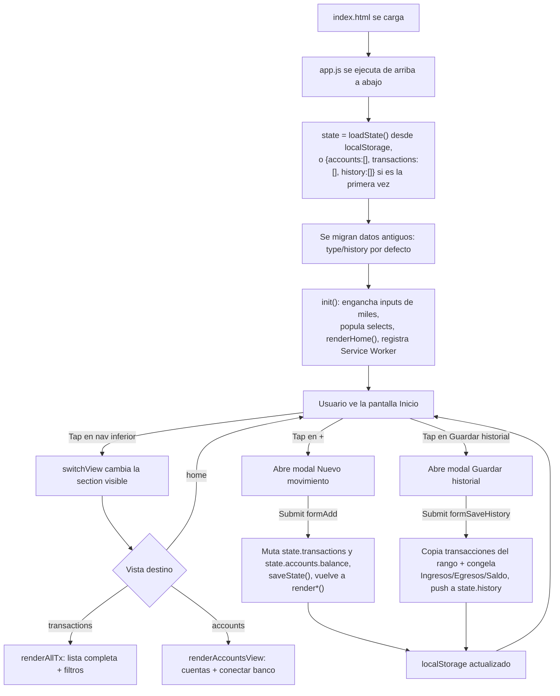
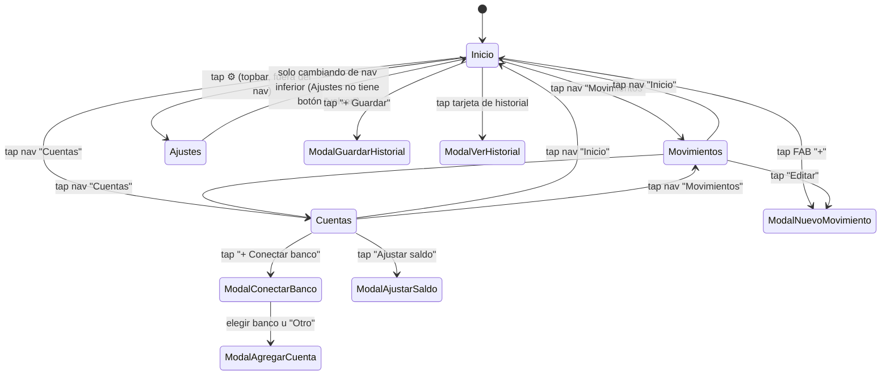

# Análisis Técnico Completo — "Mis Gastos"

> ## ⚠️ ESTE DOCUMENTO DESCRIBE LA VERSIÓN 1. YA NO DESCRIBE LA APP ACTUAL.
>
> Se conserva porque es **la razón por la que se hizo la reescritura** y porque
> sus hallazgos son la lista de lo que había que arreglar. Pero a partir de la
> versión 2.1 casi nada de lo que hay aquí sigue siendo cierto sobre el código.
>
> | Lo que dice este documento (v1) | Lo que hay hoy (v2.1) |
> |---|---|
> | PWA vanilla, un `app.js` de 939 líneas, sin capas | React + Vite + TypeScript por capas (`models/`, `storage/`, `store/`, `services/`, `components/`, `screens/`) |
> | Sin build, sin tests | Vite, ESLint, `tsc` estricto y 423 tests |
> | Estado global mutable | Store único (Zustand) con una sola capa de escritura |
> | `localStorage` accedido desde toda la vista | Una única puerta (`AppDataRepository`), verificada por regla de ESLint |
> | Escapado de HTML inconsistente (self-XSS, §16) | Desaparece por construcción: React escapa el texto |
> | "Ingresos" mostraba en realidad el saldo total (`app.js:221`) | **Saldo total** (stock) e **Ingresos del periodo** (flujo) separados y probados |
> | Calificación global 4.9/10 | — |
>
> **Para entender la app de hoy**, leer en su lugar `docs/DECISIONES-TECNICAS.md`
> (45 decisiones con su porqué) y `docs/CHECKLIST-REGRESION.md`.
>
> Las referencias a `app.js:NNN` que aparecen aquí y en los comentarios del
> código nuevo siguen siendo válidas: apuntan al código de v1, recuperable en
> el tag `v1-vanilla`.

> Documento generado en modo **solo lectura**. Ningún archivo del proyecto fue modificado para producir este análisis.
> Fecha del análisis: 2026-08-05 · Commit analizado: `5dc7494` (rama `main`)
> **Aplica a: v1 (PWA vanilla).** Marcado como histórico el 2026-08-08, al cerrar la v2.1.

## Aviso metodológico importante

Este documento sigue la plantilla de 28 secciones solicitada, pero **el proyecto real no es una aplicación React/React Native con backend, base de datos, API o hooks** — es una **PWA (Progressive Web App) estática construida en HTML + CSS + JavaScript vanilla, sin framework, sin build tool y sin backend**, con `localStorage` del navegador como único almacenamiento.

Muchas secciones de la plantilla (Redux, hooks personalizados, esquema de base de datos, endpoints API, permisos de cámara/ubicación, `package.json`, Gradle, etc.) **no aplican a este stack**. En cada una de esas secciones se explica honestamente que no aplica y qué mecanismo equivalente usa el proyecto en su lugar, en vez de inventar contenido que no existe en el código. Esto es intencional: el objetivo de este documento es una radiografía **fiel**, no un relleno genérico.

---

## Índice

1. [Arquitectura General](#1-arquitectura-general)
2. [Tecnologías Utilizadas](#2-tecnologías-utilizadas)
3. [Estructura de Carpetas](#3-estructura-de-carpetas)
4. [Componentes](#4-componentes)
5. [Pantallas](#5-pantallas)
6. [Navegación](#6-navegación)
7. [Manejo del Estado](#7-manejo-del-estado)
8. [Base de Datos](#8-base-de-datos)
9. [Modelos de Datos](#9-modelos-de-datos)
10. [API](#10-api)
11. [Servicios](#11-servicios)
12. [Hooks](#12-hooks)
13. [Utilidades](#13-utilidades)
14. [Gestión de Archivos](#14-gestión-de-archivos)
15. [Permisos](#15-permisos)
16. [Seguridad](#16-seguridad)
17. [Rendimiento](#17-rendimiento)
18. [Código](#18-código)
19. [UI](#19-ui)
20. [UX](#20-ux)
21. [Configuración](#21-configuración)
22. [Dependencias](#22-dependencias)
23. [Archivos Innecesarios](#23-archivos-innecesarios)
24. [Calidad del Proyecto](#24-calidad-del-proyecto)
25. [Problemas Encontrados](#25-problemas-encontrados)
26. [Oportunidades de Mejora](#26-oportunidades-de-mejora)
27. [Plan de Refactorización](#27-plan-de-refactorización)
28. [Mapa Completo del Proyecto (Resumen Ejecutivo)](#28-mapa-completo-del-proyecto-resumen-ejecutivo)

---

## 1. Arquitectura General

### Arquitectura utilizada

**Vanilla JS SPA de una sola página física** (un único `index.html`), sin framework, sin router, sin build step. El "ruteo" entre pantallas es en realidad **mostrar/ocultar `<section>`s** dentro del mismo DOM (`classList.add/remove("hidden")`). No hay Virtual DOM, no hay componentes reactivos: cada cambio de datos dispara funciones `render*()` que **reconstruyen manualmente** fragmentos de HTML vía `innerHTML` y vuelven a enganchar los `addEventListener`.

Patrón resultante: **"Imperative DOM rendering"** — el opuesto de arquitecturas declarativas (React/Vue). Es el patrón típico de una app construida rápido, a mano, sin capas.

No existe separación Modelo-Vista-Controlador formal, pero informalmente el código sí distingue (dentro del mismo archivo, sin fronteras físicas):
- **Datos** (`state`, constantes `CATEGORIES`/`INCOME_CATEGORIES`/`DEMO_BANKS`)
- **Lógica de negocio** (cálculo de saldos, `balanceDelta`, rangos de fecha)
- **Render** (funciones `render*`)
- **Eventos** (listeners `addEventListener` esparcidos por todo el archivo)

### Flujo completo de la aplicación



### Organización del proyecto

No hay carpetas internas de código (todo vive en la raíz del repo). La "organización" es **por archivo, no por carpeta**:

| Archivo | Responsabilidad única |
|---|---|
| `index.html` | Estructura DOM completa: 4 vistas + 8 modales |
| `app.js` | El 100% de la lógica: estado, render, eventos, utilidades |
| `style.css` | El 100% de los estilos visuales |
| `sw.js` | Service Worker (caché offline) |
| `manifest.json` | Metadatos PWA (nombre, íconos, colores) |
| `icons/` | Íconos de la app (SVG + PNG 192/512) |

### Responsabilidades de cada carpeta

```
ControlGastosApp/
├── icons/          → Activos gráficos estáticos (íconos de instalación PWA/APK)
└── (raíz)          → Todo el código fuente vive aquí, sin subcarpetas de src/
```

No existen carpetas `components/`, `pages/`, `services/`, `hooks/`, `utils/` — ese es precisamente uno de los puntos centrales a resolver en la refactorización (ver [Sección 27](#27-plan-de-refactorización)).

### Responsabilidades de cada módulo

`app.js` no está dividido en módulos ES (`import`/`export`); es un único script cargado con `<script src="app.js">` sin `type="module"`. Dentro de ese único archivo, el propio autor delimitó **regiones lógicas con comentarios separadores**, que son la aproximación más cercana a "módulos" que tiene el proyecto:

| Región (comentario en el código) | Líneas aprox. | Responsabilidad |
|---|---|---|
| `Data model` | 1–66 | Constantes de categorías/bancos + helpers de formato numérico |
| `Storage` | 68–160 | Persistencia en `localStorage`, generación de datos demo, migraciones |
| `Helpers` | 162–210 | Lookups (`categoryById`, `accountById`), cálculo de rangos de fecha |
| `Rendering: Home` | 212–403 | Pantalla Inicio: stat-grid, cuentas, gráficas, lista reciente |
| `Saved history` | 405–513 | Guardar/ver/eliminar historial |
| `Transactions view` | 515–564 | Pantalla Movimientos + filtros + borrado |
| `Accounts view` | 566–707 | Pantalla Cuentas + conectar banco + ajustar saldo |
| `Add expense modal` | 709–800 | Modal crear/editar movimiento (gasto o ingreso) |
| `Navigation` | 802–842 | Cambio de vista, tabs de periodo, botón refrescar |
| `Init` | 912–939 | Arranque de la app |

### Responsabilidades de cada pantalla

Ver detalle completo en la [Sección 5](#5-pantallas).

### Responsabilidades de cada componente

No existen "componentes" en el sentido de framework (no hay encapsulación, props ni ciclo de vida). Lo más cercano son **funciones generadoras de HTML** reutilizadas en varios lugares — documentadas como "componentes" en la [Sección 4](#4-componentes) para mantener la trazabilidad con la plantilla solicitada.

**Conclusión de la sección:** la arquitectura es deliberadamente simple (cero dependencias, cero build), adecuada para un prototipo/MVP personal, pero no escala bien: toda la lógica de negocio, todo el render y todo el manejo de eventos compiten por espacio en un único archivo de 939 líneas sin fronteras físicas entre capas.

---

## 2. Tecnologías Utilizadas

| Tecnología | Rol | Versión |
|---|---|---|
| **HTML5** | Estructura del documento único | — (sin DOCTYPE especial, estándar) |
| **CSS3** | Estilos, variables CSS (`:root`), Grid, Flexbox | — |
| **JavaScript (ES2017+ vanilla)** | Toda la lógica de la app | Sin transpilación; usa `const`/`let`, arrow functions, template literals, spread, `Array.prototype.flat`-adjacent methods, `WeakMap` |
| **Web Storage API (`localStorage`)** | Persistencia de datos en el dispositivo | Nativo del navegador |
| **Service Worker API** | Caché offline / comportamiento PWA | Nativo del navegador |
| **Web App Manifest** | Metadatos de instalación (ícono, nombre, colores) | Spec W3C estándar |
| **Canvas 2D API** | Dibujo manual de la gráfica de dona y de barras | Nativo del navegador |
| **PWABuilder (Microsoft, servicio web externo)** | Empaqueta la PWA como `.apk` Android (Trusted Web Activity) | Herramienta externa, no parte del repo |
| **GitHub Pages** | Hosting estático gratuito del sitio | Servicio externo |

### Lo que **no** usa (y es relevante aclararlo)

- **Ningún framework de UI** (no React, no Vue, no Angular, no Svelte).
- **Ningún gestor de estado** (no Redux, no Zustand, no MobX, no Context API — porque no hay React).
- **Ningún bundler/build tool** (no Vite, no Webpack, no Parcel, no Babel).
- **Ningún gestor de paquetes** (no `package.json`, no `npm`/`yarn`/`pnpm` — cero `node_modules`).
- **Ningún lenguaje tipado** (no TypeScript).
- **Ningún framework de testing** (no Jest, no Vitest, no Playwright, no Cypress).
- **Ningún backend propio** (no Node/Express, no base de datos servidor, no API REST/GraphQL).
- **Ningún SDK nativo** (no React Native, no Capacitor, no Cordova). El `.apk` se genera envolviendo la PWA en una *Trusted Web Activity* vía PWABuilder — es esencialmente una app-cascarón que abre la PWA dentro de un navegador Chrome sin barra de direcciones.

**Conclusión de la sección:** el stack es "cero dependencias" — una decisión válida para velocidad de desarrollo inicial, pero significa que **toda** funcionalidad de framework (reactividad, componentización, gestión de estado, ruteo) tuvo que reimplementarse a mano, de forma ad hoc, dentro de `app.js`.

---

## 3. Estructura de Carpetas

```
ControlGastosApp/
├── .git/                       # Historial de control de versiones (14 commits en main)
├── icons/
│   ├── icon.svg                 # Ícono vectorial base (💰 sobre fondo oscuro)
│   ├── icon-192.png              # Ícono PNG 192×192 (generado con .NET System.Drawing, no con un editor gráfico)
│   └── icon-512.png              # Ícono PNG 512×512
├── index.html                   # Documento único: 4 <section> de vista + 8 modales
├── app.js                       # Toda la lógica (939 líneas, un solo archivo)
├── style.css                    # Todos los estilos (447 líneas, un solo archivo)
├── sw.js                        # Service Worker (caché offline, 41 líneas)
├── manifest.json                # Manifiesto PWA
└── ANALISIS_COMPLETO_DEL_PROYECTO.md   # Este documento
```

No hay `src/`, `components/`, `pages/`, `hooks/`, `context/`, `services/`, `utils/`, `assets/`, `tests/`, `public/`, `build/`, `dist/`. **Todo el código fuente vive plano en la raíz del proyecto.**

### Propósito de cada carpeta existente

| Carpeta | Propósito |
|---|---|
| `icons/` | Únicos activos binarios del proyecto — íconos requeridos por `manifest.json` para la instalación como PWA/APK |
| `.git/` | Metadatos de Git (no es código de la app) |

**Conclusión de la sección:** la ausencia total de subcarpetas es consistente con el tamaño actual del proyecto (5 archivos de código), pero es la primera señal estructural de que **no hay convención de organización** que se pueda escalar sin una reestructuración completa.

---

## 4. Componentes

No hay componentes en el sentido de un framework (sin encapsulación real, sin props tipadas, sin estado local aislado, sin ciclo de vida). Lo que existe son **funciones puras/impuras que generan strings HTML o nodos DOM**, reutilizadas desde varios puntos. Se documentan aquí como "componentes lógicos":

| "Componente" (función) | Función | "Props" (argumentos) | Estado | Dependencias | Reutilización | Problemas encontrados |
|---|---|---|---|---|---|---|
| `txItemHTML(t, actions)` | Genera el HTML de una fila de movimiento (ícono, descripción, monto, acciones opcionales) | `t`: objeto transacción · `actions`: boolean (mostrar Editar/Eliminar) | Ninguno (pura) | `categoryById`, `accountById`, `escapeHTML`, `fmtMoney` | Usada en `renderRecentList`, `renderAllTx`, `openViewHistoryModal` (3 lugares) | `t.desc` se escapa con `escapeHTML`, pero `acc.nickname` **no se escapa** en la línea `tx-meta` → riesgo de HTML roto/self-XSS si el nombre de cuenta contiene `<`/`"` (ver [Sección 16](#16-seguridad)) |
| `renderAccountsRow()` | Dibuja los "chips" horizontales de cuentas en Inicio | — | Lee `state.accounts` | `fmtMoney` | Solo en Inicio | `acc.nickname` interpolado **sin** `escapeHTML` (inconsistente con `renderAccountsView`, que sí escapa) |
| `renderAccountsView()` | Dibuja la lista completa de cuentas + engancha eventos de editar/eliminar | — | Lee `state.accounts` | `escapeHTML`, `fmtMoney`, `showConfirm` | Vista Cuentas | Reconstruye y re-vincula listeners en cada render (costo bajo dado el volumen de datos, pero es un patrón fuente de fugas si el volumen crece) |
| `renderCategoryChart(transactions)` | Dibuja el donut de gastos por categoría con Canvas 2D "a mano" (sin librería) | `transactions`: array ya filtrado | Ninguno propio; usa `canvasCssHeights` (WeakMap global) | `categoryById`, `setupCanvasSize`, `dpr` | Solo Inicio | Toda la geometría (ángulos, radios) está hardcodeada inline; cero reutilización si se quisiera otro gráfico circular en otra pantalla |
| `renderTrendChart()` | Dibuja barras de gasto de los últimos 14 días | — | Ninguno | `setupCanvasSize`, `dpr`, `startOfDay`, `txInRange` | Solo Inicio | Misma falta de reutilización que el donut; recorre `state.transactions` completo cada vez (sin memoización) |
| `setupCanvasSize(canvas)` | Ajusta resolución del canvas a la densidad de píxeles del dispositivo | `canvas`: elemento DOM | **Cachea** el alto CSS original en `canvasCssHeights` (WeakMap) | `dpr()` | Compartida por ambos gráficos | Corregida en esta sesión: los atributos `width`/`height` de `<canvas>` son "reflejados" (mutar la propiedad reescribe el atributo HTML), lo que causaba crecimiento exponencial del alto en cada re-render en dispositivos con `devicePixelRatio > 1` — ya solucionado, documentado en el propio código |
| `renderRecentList(currentPeriodTx)` | Lista de los últimos 6 movimientos del periodo activo | `currentPeriodTx`: array | — | `txItemHTML` | Solo Inicio | Trunca a 6 con `.slice(0,6)` sin indicar "y N más" |
| `renderHistoryList()` | Lista de historiales guardados | — | Lee `state.history` | `escapeHTML` | Solo Inicio | — |
| `showConfirm(message, onConfirm)` | Modal de confirmación genérico reutilizable (reemplaza `window.confirm()`) | `message`: string · `onConfirm`: callback | `confirmCallback` (variable global de módulo) | — | Usado 5 veces (eliminar cuenta, eliminar movimiento, eliminar historial, restablecer demo, borrar todo) | Buen patrón — es el componente mejor diseñado del proyecto (single-responsibility, reutilizable, corrigió un bug real de `confirm()` nativo en PWA instalada en iOS) |
| `showToast(msg)` | Notificación temporal inferior | `msg`: string | `toastTimer` (variable global) | — | Usado en ~10 puntos tras cada mutación de datos | Sin cola: un segundo toast antes de que expire el primero simplemente lo reemplaza (no es un bug grave, pero no hay pila de mensajes) |

**Conclusión de la sección:** hay 2–3 "componentes" con buen diseño de responsabilidad única (`showConfirm`, `txItemHTML`, `setupCanvasSize`), pero **no hay una convención consistente de escapado de HTML**, lo cual es el hallazgo más concreto y accionable de esta sección.

---

## 5. Pantallas

Las "pantallas" son 4 elementos `<section class="view">` dentro de un único `index.html`, alternadas por `switchView()`.

### 5.1 Inicio (`#view-home`)

| Aspecto | Detalle |
|---|---|
| **Objetivo** | Dashboard principal: resumen de Ingresos/Egresos/Saldo del periodo, saldos de cuentas, gráficas, movimientos recientes, historial guardado |
| **Flujo** | Se renderiza al cargar la app y cada vez que se vuelve a esta pestaña de navegación o cambian los datos |
| **Componentes utilizados** | Tabs de periodo (Hoy/Semana/Mes), `stat-grid` (3 tiles), `accounts-row`, `categoryChart` + leyenda, `trendChart`, `recentList` (`txItemHTML`), `historyList` |
| **Lógica** | `renderHome()` calcula: `income` = suma de **saldos de todas las cuentas** (no de transacciones tipo ingreso — decisión de producto explícita tomada en esta sesión), `expense` = suma de transacciones tipo gasto en el periodo seleccionado, `net = income - expense` |
| **Estado** | `currentPeriod` ("day"/"week"/"month", variable global de módulo) |
| **Navegación** | Botón `+` (FAB) abre modal Nuevo movimiento · "Ver todos" navega a Movimientos · "+ Guardar" abre modal de historial · tocar una cuenta no navega a nada (solo informativo) |

### 5.2 Movimientos (`#view-transactions`)

| Aspecto | Detalle |
|---|---|
| **Objetivo** | Listado completo y filtrable de todas las transacciones |
| **Flujo** | Se renderiza (`renderAllTx()`) al entrar a la vista y al cambiar cualquier filtro |
| **Componentes utilizados** | Dos `<select>` de filtro (categoría, cuenta), lista `txItemHTML(t, true)` con acciones Editar/Eliminar |
| **Lógica** | Filtra `state.transactions` por `categoryId`/`accountId` en memoria, ordena por fecha descendente |
| **Estado** | Ninguno propio — lee directo de `state` y del valor actual de los `<select>` en cada render |
| **Navegación** | "Editar" abre el modal de movimiento en modo edición · "Eliminar" abre confirmación → borra y reajusta saldo |

### 5.3 Cuentas (`#view-accounts`)

| Aspecto | Detalle |
|---|---|
| **Objetivo** | Gestionar cuentas bancarias (simuladas) y su saldo |
| **Flujo** | `renderAccountsView()` al entrar |
| **Componentes utilizados** | Tarjetas de cuenta con saldo + "Ajustar saldo" + botón eliminar; botón "+ Conectar banco" |
| **Lógica** | "Conectar banco" abre selector de bancos demo (Bancolombia/Davivienda/BBVA/Nu) u "Otro" → siempre termina pidiendo el saldo real al usuario (ya no genera datos aleatorios ni transacciones falsas, corregido en esta sesión) |
| **Estado** | `customAccountEmoji` (variable global, guarda el emoji del banco elegido para usarlo al guardar) |
| **Navegación** | Ninguna transición de pantalla — todo ocurre en modales sobre esta misma vista |

### 5.4 Ajustes (`#view-settings`)

| Aspecto | Detalle |
|---|---|
| **Objetivo** | Acciones administrativas y disclaimer legal/informativo |
| **Flujo** | Estático, sin `render*()` propio (el contenido es fijo en el HTML) |
| **Componentes utilizados** | "Restablecer datos de demo", "Borrar todos los datos", texto de disclaimer sobre la conexión bancaria simulada |
| **Lógica** | Ambos botones pasan por `showConfirm()` antes de mutar `state` completo |
| **Estado** | Ninguno |
| **Navegación** | Se accede solo desde el ícono ⚙️ de la barra superior — **no está en el nav inferior**, es una vía de acceso distinta al resto de pantallas (inconsistencia de navegación, ver [Sección 6](#6-navegación)) |

**Conclusión de la sección:** cada pantalla tiene una responsabilidad clara y no hay lógica de negocio duplicada entre ellas (todas comparten las mismas funciones de cálculo/formato), pero **ninguna pantalla es una entidad aislable**: todas leen y escriben directamente sobre la misma variable global `state`.

---

## 6. Navegación

### Cómo navega la aplicación

No hay Router. La navegación es 100% manual vía `switchView(name)`:

```js
function switchView(name) {
  document.querySelectorAll(".view").forEach(v => v.classList.add("hidden"));
  document.getElementById("view-" + name).classList.remove("hidden");
  document.querySelectorAll(".nav-btn").forEach(b => b.classList.toggle("active", b.dataset.view === name));
  if (name === "transactions") renderAllTx();
  if (name === "accounts") renderAccountsView();
  if (name === "home") renderHome();
}
```

### Rutas

**No existen rutas de URL.** No hay `#hash`, no hay History API (`pushState`), no hay `<a href>`. Toda la navegación vive en memoria (variable `currentPeriod` + clases `hidden` en el DOM). Consecuencia directa: **el botón "Atrás" del navegador/Android no funciona dentro de la app** — sale de la app en vez de volver a la pantalla anterior. Recargar la página (F5, o el nuevo botón 🔄 Refrescar) **siempre vuelve a Inicio**, perdiendo cualquier vista/modal en la que estuviera el usuario.

### Pantallas protegidas

No aplica — no hay autenticación ni usuarios, por lo tanto no hay concepto de rutas protegidas/públicas.

### Flujo de navegación



### Problemas encontrados

1. **Ajustes no está en el nav inferior** — es la única pantalla accesible solo desde un ícono en la barra superior, rompiendo la consistencia del patrón de navegación con el resto de la app.
2. **Sin historial de navegación real** — botón Atrás del sistema no coopera con la app (no hay integración con la History API).
3. **Sin deep-linking** — imposible compartir/guardar un enlace directo a "Movimientos" o a un historial guardado específico.
4. **`switchView` no valida `name`** — si se llamara con un valor inválido, `document.getElementById("view-" + name)` sería `null` y el `.classList.remove` siguiente lanzaría `TypeError` (no ocurre hoy porque todas las llamadas usan valores fijos, pero no hay guardas defensivas).

**Conclusión de la sección:** la navegación funciona para el caso feliz de una app de una sola pantalla lógica con pestañas, pero carece de las garantías mínimas que un router real (aunque fuera minimalista, tipo un mini hash-router) le daría: historial, deep-linking, validación.

---

## 7. Manejo del Estado

No aplica React (no hay `useState`, `Context`, `Redux`, `Zustand`, `MobX`, `Providers`, ni hooks personalizados). El "gestor de estado" del proyecto es:

### El objeto global `state`

```js
let state = loadState() || { accounts: [], transactions: [], history: [] };
```

Una **única variable global mutable**, declarada con `let` a nivel de módulo, accesible y mutable desde *cualquier* función del archivo sin restricciones. No hay:
- Inmutabilidad (se muta directo: `acc.balance += ...`, `state.transactions.push(...)`, `state.accounts = state.accounts.filter(...)`)
- Suscripciones/observadores (nadie "escucha" cambios de `state`; cada mutación va seguida manualmente de las llamadas `render*()` necesarias)
- Un único punto de verdad para "cuándo persistir" — `saveState()` se llama manualmente después de cada mutación (14 puntos de llamada distintos), con el riesgo de olvidar alguno

### Otras variables de estado "de módulo" (fuera de `state`)

| Variable | Propósito | Ámbito |
|---|---|---|
| `currentPeriod` | Pestaña de periodo activa en Inicio (day/week/month) | Global de módulo |
| `editingTxId` | ID de la transacción en edición (o `null`) — controla si el submit del modal crea o actualiza | Global de módulo |
| `customAccountEmoji` | Emoji del banco prellenado al abrir el formulario de cuenta personalizada | Global de módulo |
| `confirmCallback` | Callback pendiente del modal de confirmación genérico | Global de módulo |
| `toastTimer` | ID del `setTimeout` del toast activo | Global de módulo |
| `canvasCssHeights` | `WeakMap` que cachea el alto CSS real de cada `<canvas>` | Global de módulo |

### Dónde se usa cada patrón

No hay Context/Redux/Zustand/MobX/hooks — la tabla anterior **es** el inventario completo de "estado" del proyecto.

**Conclusión de la sección:** el patrón de estado global mutable es funcional a esta escala (una sola vista activa a la vez, sin concurrencia), pero es el hallazgo arquitectónico más importante para la refactorización: **no hay forma de saber, mirando una función aislada, qué otras partes de la UI dependen de un cambio de estado** — hay que rastrear manualmente cada llamada a `render*()`.

---

## 8. Base de Datos

**No hay base de datos (ni local tipo SQLite/IndexedDB, ni remota).** El "almacén de datos" es `localStorage`, bajo una única clave:

```js
const STORAGE_KEY = "gastos_app_data_v1";
localStorage.setItem(STORAGE_KEY, JSON.stringify(state));
```

Esto implica:
- **Todo el estado es un único blob JSON** — no hay tablas, no hay índices, no hay consultas indexadas; cada "consulta" es un `.filter()`/`.find()` en memoria sobre arrays JS después de deserializar el JSON completo.
- **Límite de tamaño**: `localStorage` típicamente soporta ~5-10 MB por origen — suficiente para miles de movimientos, pero sin ningún control ni aviso si se acerca al límite.
- **Sin transacciones atómicas reales**: si `saveState()` falla a mitad de una operación compleja (poco probable pero posible si el storage está lleno), no hay rollback.
- **Sin sincronización entre dispositivos**: los datos viven solo en el navegador/APK de un dispositivo. Instalar la app en otro celular = empezar de cero.

### "CRUD" existente (sobre el JSON en memoria, no sobre una BD real)

| Entidad | Create | Read | Update | Delete |
|---|---|---|---|---|
| Cuenta (`accounts`) | `formCustomAccount` submit | `renderAccountsView`, `renderAccountsRow` | `formEditBalance` submit (solo el saldo) | Botón ✕ en `renderAccountsView` |
| Movimiento (`transactions`) | `formAdd` submit (modo creación) | `renderAllTx`, `renderRecentList`, gráficas | `formAdd` submit (modo edición, vía `editingTxId`) | `deleteTransaction()` |
| Historial (`history`) | `formSaveHistory` submit | `renderHistoryList`, `openViewHistoryModal` | No editable una vez creado | Botón "Eliminar historial" |

### Modelo entidad-relación (en texto, ya que no es SQL real)

```
┌─────────────────┐         ┌──────────────────────┐
│     Account      │        │     Transaction        │
├─────────────────┤        ├──────────────────────┤
│ id (PK, string)   │◄──────┤ accountId (FK, string) │
│ bankId            │  1   N│ id (PK, string)         │
│ bankName           │        │ date (string YYYY-MM-DD)│
│ type (string libre)│        │ amount (number)         │
│ nickname           │        │ desc (string)           │
│ balance (number)   │        │ categoryId (string)     │
│ emoji              │        │ source ("manual"|"bank")│
└─────────────────┘        │ type ("expense"|"income")│
                             └──────────────────────┘
                                       ▲
                                       │ copia (snapshot, no FK real)
                                       │
                             ┌──────────────────────┐
                             │     HistoryEntry        │
                             ├──────────────────────┤
                             │ id (PK, string)          │
                             │ name                     │
                             │ startDate / endDate       │
                             │ savedAt                  │
                             │ income / expense / balance│
                             │ transactions[] (COPIA     │
                             │   congelada, no referencia)│
                             └──────────────────────┘
```

Nota clave: `HistoryEntry.transactions` es una **copia profunda** (`JSON.parse(JSON.stringify(...))`) del momento del guardado, **no** una relación por ID — es decir, es intencionalmente una "foto" desconectada del resto del sistema (decisión de producto correcta para el caso de uso, pero significa que **no hay integridad referencial**: si luego se borra la cuenta original, el historial guardado sigue mostrando el `accountId` viejo sin forma de resolverlo a un nombre de cuenta).

**Conclusión de la sección:** el modelo de datos es razonable para el volumen actual (uso personal, cientos de movimientos), pero **no tiene ninguna de las garantías de una base de datos real**: sin índices, sin validación de esquema en tiempo de escritura, sin migraciones versionadas más allá de dos parches ad hoc (`t.type = t.type || "expense"`, `state.history = state.history || []`).

---

## 9. Modelos de Datos

### `Account`

| Campo | Tipo | Obligatorio | Validación actual |
|---|---|---|---|
| `id` | `string` (generado por `uid()`) | Sí | Ninguna (siempre generado internamente) |
| `bankId` | `string` (`"manual"` o id de `DEMO_BANKS`) | Sí | Ninguna |
| `bankName` | `string` | Sí | `.trim()` en el formulario, pero **sin límite de longitud** ni sanitización de caracteres |
| `type` | `string` libre (uno de 5 valores del `<select>`, o cualquier string si viene de datos antiguos) | Sí | Restringido por `<select>` en el formulario, no en el modelo |
| `nickname` | `string` | Sí | Igual a `bankName` en la creación actual (no hay campo de apodo separado) |
| `balance` | `number` (puede ser negativo, ej. tarjetas de crédito) | Sí | `isNaN(balance)` bloquea el submit; **sin rango mínimo/máximo** |
| `emoji` | `string` (un emoji) | Sí | Fijo según el banco elegido o `🏦` por defecto |

### `Transaction`

| Campo | Tipo | Obligatorio | Validación actual |
|---|---|---|---|
| `id` | `string` | Sí | Generado internamente |
| `date` | `string` `YYYY-MM-DD` | Sí | Input `type="date"` nativo del navegador |
| `amount` | `number` (siempre positivo; el signo lo da `type`) | Sí | `!amount \|\| amount <= 0` bloquea el submit; **sin tope superior** |
| `desc` | `string` | Sí | `.trim()`, `required` en el HTML; sin límite de longitud |
| `categoryId` | `string` (id de `CATEGORIES` o `INCOME_CATEGORIES`) | Sí | Restringido por `<select>` |
| `accountId` | `string` (FK a `Account.id`) | Sí | Restringido por `<select>` (solo cuentas existentes) |
| `source` | `"manual" \| "bank"` | Sí | `"bank"` solo en datos demo generados por `makeDemoState()`; todo lo creado por el usuario es `"manual"` |
| `type` | `"expense" \| "income"` | Sí | Toggle Gasto/Ingreso en el modal; migración por defecto a `"expense"` para datos antiguos |

### `HistoryEntry`

| Campo | Tipo | Obligatorio | Validación actual |
|---|---|---|---|
| `id` | `string` | Sí | Generado internamente |
| `name` | `string` | Sí | `.trim()`, `required` |
| `startDate` / `endDate` | `string` `YYYY-MM-DD` | Sí | Se valida `startDate <= endDate` antes de guardar |
| `savedAt` | `string` `YYYY-MM-DD` | Sí | `todayISO()` en el momento de guardar |
| `income` / `expense` / `balance` | `number` | Sí (desde el fix de esta sesión) | Congelados al momento de guardar; entradas antiguas sin estos campos usan un *fallback* calculado en `openViewHistoryModal` |
| `transactions` | `Transaction[]` (copia profunda) | Sí | Filtradas por rango de fecha inclusive |

### Relaciones

- `Transaction.accountId` → `Account.id` (muchos a uno, **sin integridad referencial** — borrar una cuenta no toca sus transacciones existentes, que quedan con un `accountId` huérfano y se muestran como `"—"` gracias a un chequeo defensivo en `txItemHTML`)
- `Transaction.categoryId` → `CATEGORIES`/`INCOME_CATEGORIES` (catálogo estático en código, no en `state`)
- `HistoryEntry.transactions` → copia desconectada, no relación

**Conclusión de la sección:** los tres modelos son simples y coherentes entre sí, pero la validación vive **enteramente en el formulario** (HTML5 `required` + un par de checks JS puntuales), no en un límite de dominio/modelo — cualquier código futuro que mute `state` directamente (como ya hacen varias funciones) puede introducir datos inconsistentes sin que nada lo impida.

---

## 10. API

**No existe ninguna API.** No hay backend, no hay `fetch()` a ningún servidor propio, no hay endpoints REST/GraphQL, no hay autenticación de sesión ni tokens.

El único uso de red del proyecto es:
- `fetch()` **dentro de `sw.js`**, pero es para descargar los propios archivos estáticos de la app (HTML/CSS/JS/íconos) desde el mismo origen, no una API de datos.
- La "conexión bancaria" es **100% simulada en el cliente**: al "conectar" un banco, la app únicamente pide al usuario el nombre/tipo/saldo y crea una `Account` local — no se contacta ningún servidor bancario real. Esto está declarado explícitamente en el disclaimer de Ajustes.

**Conclusión de la sección:** no aplica. Si en el futuro se integra un agregador bancario real (Plaid/Belvo, como sugiere el disclaimer en la app), ahí sí nacería la primera superficie de API + autenticación del proyecto, y tendría que diseñarse desde cero (ver recomendaciones en la [Sección 26](#26-oportunidades-de-mejora)).

---

## 11. Servicios

No hay una capa `services/` separada. Las funciones más cercanas a "servicios" (lógica de negocio/datos desacoplada de la UI) son:

| "Servicio" (función) | Responsabilidad | Métodos relacionados | Dependencias |
|---|---|---|---|
| **Persistencia** | Leer/escribir el estado completo en `localStorage` | `loadState()`, `saveState()` | `localStorage`, `JSON` |
| **Generador de datos demo** | Construir un `state` de ejemplo con cuentas y movimientos aleatorios realistas | `makeDemoState()` | `uid()`, `Math.random` |
| **Cálculo de saldo** | Determinar cuánto debe sumar/restar una transacción al saldo de su cuenta | `balanceDelta(tx)` | — |
| **Rango de fechas** | Calcular inicio/fin de "hoy"/"esta semana"/"este mes" | `periodRange(period)`, `startOfDay`, `startOfWeek`, `startOfMonth`, `txInRange` | `Date` nativo |
| **Formato de moneda** | Formatear números como pesos colombianos (`$1.234.567`) | `fmtMoney(n)` | `Number.prototype.toLocaleString` |
| **Formato de entrada numérica** | Separadores de miles en vivo mientras el usuario escribe | `attachThousandsInput`, `getNumericInputValue`, `setNumericInputValue` | — |
| **Lookup de catálogos** | Resolver categoría/cuenta por id | `categoryById(id)`, `accountById(id)` | `CATEGORIES`, `INCOME_CATEGORIES`, `state.accounts` |
| **Sanitización** | Escapar texto antes de insertarlo como HTML | `escapeHTML(s)` | DOM (`div.textContent`) |

Estas funciones **sí están razonablemente desacopladas de la UI** (no tocan el DOM, salvo `escapeHTML` que usa un `<div>` invisible como truco de escape) — son el código más "reutilizable" del proyecto y los mejores candidatos a moverse tal cual a una futura carpeta `services/` o `utils/` en la refactorización.

**Conclusión de la sección:** el proyecto sí tiene una capa de lógica de negocio razonablemente pura, solo que **físicamente mezclada** en el mismo archivo que el render y los event listeners — separarla es de bajo riesgo porque ya está funcionalmente aislada.

---

## 12. Hooks

**No aplica.** No hay React, por lo tanto no hay hooks (`useState`, `useEffect`, hooks personalizados). El único paralelismo conceptual son los **`addEventListener`**, que cumplen el rol de "efectos" pero se registran una sola vez (o se re-registran manualmente tras cada `innerHTML =` que reemplaza nodos, como en `renderAllTx`, `renderAccountsView`, `renderHistoryList`).

**Conclusión de la sección:** no aplica al stack actual.

---

## 13. Utilidades

| Función utilitaria | Ubicación | Función |
|---|---|---|
| `uid()` | `app.js:31` | Genera un ID pseudo-único combinando timestamp en base36 + random — **no es un UUID real**, hay una probabilidad (baja pero no nula) de colisión bajo generación muy rápida en el mismo milisegundo |
| `todayISO()` | `app.js:35` | Fecha de hoy en formato `YYYY-MM-DD` |
| `fmtMoney(n)` | `app.js:39` | Formatea un número como `$1.234.567` (o `-$1.234.567`), redondeando con `Math.round` |
| `attachThousandsInput` / `getNumericInputValue` / `setNumericInputValue` | `app.js:46-66` | Trío de utilidades para inputs de texto que simulan un campo numérico con separadores de miles en vivo (soportan negativos para saldos de tarjetas de crédito) |
| `escapeHTML(s)` | `app.js:389` | Escapa HTML usando la técnica `div.textContent = s; return div.innerHTML` |
| `dpr()` | `app.js:340` | Devuelve `window.devicePixelRatio \|\| 1` |
| `startOfDay` / `startOfWeek` / `startOfMonth` | `app.js:175-186` | Normalizan una fecha al inicio de su día/semana(lunes)/mes |
| `periodRange(period)` | `app.js:188` | Devuelve `{start, end, prevStart, prevEnd}` para un periodo dado — nótese que `prevStart`/`prevEnd` ya **no se usan** en ningún lado del código actual (código muerto parcial, ver [Sección 23](#23-archivos-innecesarios)) |
| `txInRange(tx, start, end)` | `app.js:207` | Compara si la fecha de una transacción cae en un rango |

No hay un archivo `utils.js` separado — todas estas funciones conviven en `app.js`.

**Conclusión de la sección:** son utilidades pequeñas, puras (salvo `escapeHTML`, que usa el DOM como truco) y bien nombradas — el bloque de código más "profesional" del proyecto pese a no estar en su propio archivo.

---

## 14. Gestión de Archivos

- **Imágenes**: la app **no permite al usuario subir ni ver imágenes** (no hay `<input type="file">`, no hay comprobantes/recibos adjuntos a un movimiento). Los únicos archivos de imagen son los íconos estáticos de la PWA (`icons/icon-192.png`, `icons/icon-512.png`, `icons/icon.svg`), embebidos en el propio repo.
- **PDFs**: no aplica — no se generan ni se leen PDFs (no hay exportación de reportes).
- **Archivos genéricos**: no aplica.
- **Cámara**: no aplica — no hay captura de fotos de recibos ni escaneo de documentos.
- **Escáner**: no aplica.
- **Descargas**: no aplica — no hay funcionalidad de exportar datos (ni CSV, ni JSON, ni PDF). El "Historial guardado" es la única forma de conservar un snapshot, pero vive **dentro** de `localStorage`, no como archivo descargable.
- **Subidas**: no aplica.

**Conclusión de la sección:** esta es una app puramente de **entrada de datos por formulario** — no maneja ningún tipo de archivo binario más allá de sus propios activos estáticos. Es una ausencia notable para una app financiera: no hay forma de adjuntar comprobante a un gasto ni de exportar los datos a un archivo (backup manual).

---

## 15. Permisos

- **Cámara**: no se solicita (no hay funcionalidad que la use).
- **Almacenamiento**: no se solicita ningún permiso explícito de almacenamiento — usa `localStorage`, un mecanismo del navegador que no requiere permiso del sistema operativo. Como APK (empaquetado vía PWABuilder/Trusted Web Activity), el almacenamiento vive dentro del sandbox de Chrome/WebView, no en el almacenamiento compartido del dispositivo.
- **Ubicación**: no se solicita (no hay funcionalidad que la use).
- **Internet**: implícito en el `AndroidManifest.xml` que genera PWABuilder para el `.apk` (no versionado en este repo — es generado por la herramienta externa), necesario para la primera carga y para el registro del Service Worker.
- **Notificaciones**: no se solicita (no hay `Notification API` ni push notifications implementadas).
- **Otros permisos**: ninguno.

**Conclusión de la sección:** la app no solicita ningún permiso sensible del dispositivo — coherente con ser una app 100% local/offline sin cámara, ubicación ni notificaciones. El único "permiso" real es el que el navegador pide para instalar la PWA en pantalla de inicio, que no es un permiso de SO sino una acción del navegador.

---

## 16. Seguridad

*(Solo diagnóstico — sin proponer soluciones aún, tal como se pidió.)*

### Manejo de credenciales

No hay credenciales de usuario en la app (no hay login, no hay contraseñas, no hay tokens de sesión). El único punto donde el proyecto *toca* el tema es el disclaimer explícito en Ajustes, que aclara que la conexión bancaria es simulada y que ninguna credencial bancaria real se solicita ni almacena — esto es coherente con lo que hace el código: `formCustomAccount` solo pide nombre/tipo/saldo, nunca usuario/contraseña de banco.

### Tokens

No aplica — no hay autenticación.

### Variables de entorno

No existen (no hay `.env`, no hay `process.env` — no habría dónde ejecutarlo, es JS de navegador puro sin build step). No hay secretos de ningún tipo en el repo.

### Almacenamiento seguro

Todo el estado financiero del usuario (saldos, movimientos) se guarda **en texto plano, sin cifrar**, en `localStorage`. Implicaciones:
- Cualquier script que logre ejecutarse en el mismo origen (XSS) puede leer/escribir libremente `localStorage.getItem("gastos_app_data_v1")`.
- En un dispositivo compartido o comprometido, los datos financieros son legibles por cualquier proceso con acceso al perfil del navegador/WebView.
- No hay PIN/biometría para abrir la app, pese a mostrar saldos y montos de dinero real.

### Riesgos y vulnerabilidades identificadas (diagnóstico, sin arreglar)

1. **Escapado de HTML inconsistente (self-XSS)** — confirmado leyendo el código: `t.desc` se escapa con `escapeHTML()` en `txItemHTML`, pero `acc.nickname` **no** se escapa en `renderAccountsRow()` (línea `<div class="bank">${acc.emoji} ${acc.nickname}</div>`) ni en `tx-meta` dentro de `txItemHTML` (`${acc ? acc.nickname : "—"}`), mientras que sí se escapa correctamente en `renderAccountsView()`. Como el nombre de cuenta es texto libre ingresado por el propio usuario (`caName`), un nombre como `` se ejecutaría al renderizarse en los puntos no escapados. El impacto real es bajo (es un solo usuario local inyectándose a sí mismo, sin datos de terceros ni sesión que robar), pero es una inconsistencia de práctica insegura documentable y de corrección trivial.
2. **Sin cifrado en reposo** — datos financieros en texto plano en `localStorage`, sin ninguna capa de cifrado (ni siquiera ofuscación básica).
3. **Sin bloqueo de acceso a la app** — no hay PIN, patrón ni biometría; cualquiera con el dispositivo desbloqueado ve saldos y movimientos completos de inmediato.
4. **`caches.keys()` + `caches.delete()` accesible al usuario vía el botón Refrescar** — no es una vulnerabilidad de terceros (solo afecta al propio dispositivo del usuario), pero conviene señalar que un fallo ahí (ya mitigado con el chequeo `navigator.onLine`) podría haber dejado la PWA sin caché y sin red, es decir inutilizable temporalmente.
5. **Falta de límites de longitud/tamaño en inputs de texto** (`desc`, `bankName`, `histName`) — no es una vulnerabilidad de inyección (todo queda en el mismo cliente), pero sí una superficie abierta a que un usuario (accidental o intencionalmente) infle el JSON de `localStorage` con strings extremadamente largos.
6. **Ningún `Content-Security-Policy`** definido (ni meta tag, ni cabecera HTTP, dependiente del hosting de GitHub Pages) — en caso de que el hallazgo #1 se explotara, no hay una segunda capa de defensa que lo mitigue.

**Conclusión de la sección:** el modelo de amenaza actual es bajo por ser una app de un solo usuario, sin backend y sin datos de terceros — pero **no es cero**: existe una inconsistencia de escapado de HTML real y verificable en el código, y cero protección de acceso o cifrado para datos que son, por naturaleza, sensibles (información financiera personal).

---

## 17. Rendimiento

### Renderizados innecesarios / re-renderizados

- Cada mutación de datos dispara un **re-render completo** de la sección afectada vía `innerHTML =`, reconstruyendo TODO el subárbol DOM (no hay diffing). Para el volumen actual (decenas/cientos de movimientos) esto es imperceptible; con miles de movimientos, reconstruir `allTxList` completo en cada filtro sería notablemente más lento que un enfoque virtualizado.
- `renderHome()` llama en cascada a `renderAccountsRow()`, `renderCategoryChart()`, `renderTrendChart()`, `renderRecentList()`, `renderHistoryList()` — **siempre las 5**, incluso si el cambio que disparó el render solo afectaba a una de ellas (p. ej. cambiar el saldo de una cuenta re-dibuja ambas gráficas Canvas sin necesidad).
- `renderTrendChart()` recorre **todo** `state.transactions` (sin filtrar por periodo) cada vez que se llama, para construir 14 buckets diarios — coste O(n) en cada render de Inicio, sin memoización.

### Componentes pesados

Los dos `<canvas>` (donut y barras) son el trabajo más costoso por render — implican `getBoundingClientRect()`, mutación de `canvas.width`/`height` (que fuerza una reasignación completa del backing store) y decenas de llamadas al contexto 2D. Ya se corrigió el bug que causaba **crecimiento exponencial** de esta operación (ver hallazgo de la [Sección 1](#1-arquitectura-general)); tras la corrección, el coste es proporcional al tamaño real del canvas, no explosivo.

### Consultas

No hay consultas a base de datos (no existe backend). Las "consultas" son `.filter()`/`.find()`/`.reduce()` de JavaScript en memoria — eficientes hasta varios miles de elementos, sin necesidad de índices a esta escala.

### Memoria

- `state` completo vive permanentemente en memoria mientras la pestaña/app esté abierta — no hay paginación ni carga perezosa.
- El `WeakMap` `canvasCssHeights` está bien diseñado para no fugar memoria (las claves se liberan solas si el canvas se elimina del DOM).
- No se detectaron listeners que se acumulen sin límite: los `innerHTML =` que reemplazan nodos también destruyen sus listeners asociados junto con los nodos, así que no hay fuga de listeners en el patrón actual (aunque sí hay **re-trabajo** de re-vincularlos en cada render).

### Caché

- El Service Worker implementa una estrategia **stale-while-revalidate manual**: sirve la copia cacheada de inmediato y actualiza la caché en segundo plano para la *siguiente* carga — lo que explica el problema (ya trabajado y mitigado con el botón 🔄) de que un cambio de código necesitaba dos recargas para verse reflejado.
- No hay caché de cálculos en memoria (p. ej. memoizar `periodRange` o los totales de categoría entre renders consecutivos si los datos no cambiaron).

**Conclusión de la sección:** el rendimiento es adecuado para el volumen de datos de un usuario personal (cientos de movimientos), pero el patrón "re-renderiza todo siempre" y la ausencia de memoización son deuda técnica que se notaría con miles de movimientos o en dispositivos de gama baja.

---

## 18. Código

### Calidad

Código legible, bien indentado, con nombres de variables/funciones claros en inglés (mientras que los textos de UI están en español) y comentarios puntuales **de alto valor** allí donde documentan decisiones no obvias (p. ej. el bug de `canvas.height` reflejado, o por qué `balanceDelta` devuelve 0 para gastos). Esto es una señal positiva poco común en código "hecho rápido".

### Organización

Un solo archivo de 939 líneas para toda la lógica. Dentro de él, organizado por comentarios de sección (ver [Sección 1](#1-arquitectura-general)), pero sin fronteras físicas — nada impide que código de una "región" llame directamente a variables/funciones de otra sin pasar por una interfaz clara.

### Duplicación

- El patrón `document.getElementById("modalX").classList.add/remove("hidden")` se repite **más de 40 veces** de forma casi idéntica en todo el archivo — nunca se extrajo a un helper `openModal(id)`/`closeModal(id)`.
- El patrón de "obtener valor de un campo, validar, mutar `state`, `saveState()`, cerrar modal, re-renderizar, `showToast()`" se repite con ligeras variaciones en los 6 formularios (`formAdd`, `formCustomAccount`, `formEditBalance`, `formSaveHistory`, y los handlers de borrado) — un candidato claro a una función genérica de "guardar formulario".
- Los tres pares `renderX()` + `document.getElementById("btnX").addEventListener(...)` que abren/cierran cada modal repiten la misma estructura (abrir con reset de campos, cancelar oculta) sin abstracción común.

### Complejidad

Baja complejidad ciclomática por función (la mayoría de las funciones son cortas y de un solo propósito) — la complejidad real del proyecto no está en la lógica individual sino en el **acoplamiento entre funciones** vía el estado global compartido.

### Acoplamiento

**Alto.** Prácticamente cada función lee o escribe directamente sobre `document.getElementById(...)` y sobre `state`. No hay una interfaz que aísle "lógica de negocio" de "DOM" — por ejemplo, `deleteTransaction(id)` sí está bien aislada (no toca el DOM), pero el handler que la llama mezcla en la misma línea la llamada de negocio con 3 llamadas de render y un toast.

### Cohesión

Alta cohesión **dentro** de cada bloque de funciones relacionadas con una pantalla (todo lo de "Accounts view" está junto, todo lo de "Saved history" está junto), pero cohesión débil a nivel de archivo completo — mezclar constantes de dominio, utilidades puras, render de UI y wiring de eventos en el mismo archivo diluye la cohesión global.

### Código muerto

- `periodRange()` calcula y devuelve `prevStart`/`prevEnd`, pero **ningún llamador actual los usa** (`renderHome()` los destructura con `const { start, end } = periodRange(...)`, descartando `prevStart`/`prevEnd`) — resto de una función anterior que sí comparaba contra el periodo previo (la comparación "▲ 13% vs. ayer" que existía antes de que se rediseñara el `stat-grid`).
- `let charts = {}` (línea 215) se declara pero **nunca se usa** en ningún otro punto del archivo.

### Código repetido

Ver "Duplicación" arriba — es el hallazgo de código más accionable de esta sección.

**Conclusión de la sección:** la calidad *local* del código (nombres, comentarios, funciones puras) es buena; el problema es *estructural*: todo vive en un mismo archivo con alto acoplamiento al DOM y al estado global, con duplicación de patrones de modal/formulario que una capa de utilidades resolvería fácilmente.

---

## 19. UI

### Diseño

Tema oscuro consistente ("dark mode" fijo, sin modo claro ni detección de preferencia del sistema), con una paleta definida por variables CSS en `:root` (`--bg`, `--surface`, `--accent`, `--danger`, `--safe`, etc.) — buena práctica que facilitaría un futuro re-tematizado.

### Consistencia

Alta consistencia visual: todos los modales comparten la misma estructura (`modal-overlay` → `modal-sheet` con "handle" superior, tipo bottom-sheet), todos los botones primarios/secundarios reutilizan las mismas clases `.primary-btn`/`.secondary-btn`, todas las tarjetas comparten radios de borde (`--radius: 16px`) y colores de superficie.

### Colores

- `--accent: #6c8dff` (azul-violeta) para acciones primarias y estados activos.
- `--safe: #4bd9c0` (verde-turquesa) para ingresos/saldos positivos.
- `--danger: #ff6b7a` (rojo-coral) para egresos/saldos negativos/acciones destructivas.
- Reutilización correcta y semántica de estos tres colores en toda la app (tabs activos, montos, botones de peligro).

### Tipografía

Fuente del sistema (`-apple-system, BlinkMacSystemFont, "Segoe UI", Roboto, ...`) — decisión pragmática y de buen rendimiento (cero fuentes web que descargar), aunque sacrifica identidad de marca tipográfica propia.

### Espaciados

Espaciados consistentes en múltiplos de 4/8px a lo largo de todo el CSS (`gap: 8px`, `padding: 12px`, `margin-top: 16px`, etc.) — no hay un sistema de *design tokens* de espaciado formal (no hay `--space-1`, `--space-2`...), pero el patrón visual resultante es uniforme.

### Componentes

Los "componentes visuales" (tiles, tarjetas, chips, bottom-sheets, toast) están bien diferenciados y son reconocibles/reutilizados consistentemente — el CSS, igual que el JS, está todo en un único archivo sin organización en partials, pero internamente sí sigue un orden lógico (layout general → por sección → modales → toast).

### Responsive

- El contenedor principal `#app` tiene `max-width: 480px` — diseño "mobile-first" estricto, centrado en pantalla en viewports más anchos (se ve como una app de celular incluso en desktop, lo cual es intencional dado que el destino final es un APK).
- No hay *breakpoints* para tablet/desktop — a propósito, ya que el producto está pensado 100% para uso móvil.
- Uso de `env(safe-area-inset-top/bottom)` para respetar notch/barra de gestos en dispositivos modernos — buena práctica encontrada.

**Conclusión de la sección:** la UI es notablemente pulida y consistente para no usar ningún sistema de diseño ni librería de componentes — el mayor riesgo a futuro es que, al no existir *design tokens* documentados más allá de las variables de color, escalar a un modo claro o a una segunda marca/tema requeriría trabajo manual adicional.

---

## 20. UX

### Flujo del usuario

Flujos cortos y directos: agregar un movimiento son 2 taps (FAB → completar formulario) + 1 submit; conectar una cuenta son 2 taps + 1 submit. El uso de *bottom sheets* para todos los modales es coherente con patrones nativos de Android/iOS, minimizando la fricción de "otra pantalla".

### Facilidad de uso

- El toggle Gasto/Ingreso dentro del mismo modal (en vez de dos flujos separados) reduce la carga cognitiva.
- Los separadores de miles en vivo (agregados en esta sesión) evitan que el usuario tenga que "contar ceros" al escribir montos grandes — mejora de UX real y medible.
- La función de historial (guardar por rango de fechas y nombre) resuelve una necesidad genuina de "cerrar" un periodo contable, aunque **no está descubierta**: no hay ningún *onboarding* ni tooltip que explique qué es o para qué sirve la primera vez que se ve la sección vacía ("Aún no has guardado historial.") — el texto es claro pero pasivo.

### Errores

- Los errores de validación son **silenciosos**: si el usuario deja el monto vacío y presiona "Guardar", el `if (!amount || amount <= 0 || !desc || !date) return;` simplemente **no hace nada** — no hay mensaje de error visible, ni resaltado de campo, ni foco automático al campo problemático. El usuario solo percibe que "no pasó nada".
- Las validaciones HTML5 nativas (`required`) sí disparan el tooltip nativo del navegador para campos vacíos, pero las validaciones JS adicionales (monto ≤ 0, fecha "Desde" > "Hasta") no tienen equivalente visual — usan `showToast()` en el caso de fechas, pero **no** en el caso del formulario principal de movimientos.

### Mensajes

- `showToast()` da retroalimentación positiva clara tras cada acción exitosa ("Gasto guardado", "Cuenta agregada", "Historial eliminado") — buen patrón, consistente en toda la app.
- El modal de confirmación genérico (`showConfirm`) da contexto claro antes de acciones destructivas ("¿Eliminar este movimiento? Si afectaba el saldo de una cuenta, se le devolverá el monto.") — mensaje informativo, no solo un "¿Estás seguro?" genérico.

### Accesibilidad

- Hay algunos `aria-label` (`btnSettings`, `btnRefresh`, `btnAdd`, `remove-btn` de cuentas) — cobertura parcial, no sistemática (los botones "Editar"/"Eliminar" de movimientos, por ejemplo, no llevan `aria-label` adicional más allá de su texto visible, lo cual en este caso sí es suficiente).
- **Los modales no tienen `role="dialog"`, `aria-modal="true"` ni gestión de foco** (no atrapan el foco del teclado dentro del modal, no lo devuelven al elemento que abrió el modal al cerrarlo) — un lector de pantalla no sabría que se abrió un diálogo modal.
- No se detectó soporte de cierre con tecla `Escape` en ningún modal.
- No se auditó contraste de color número por número, pero a simple vista el contraste texto/fondo (`--text: #eef2ff` sobre `--bg: #0b1220`) es alto y probablemente cumple WCAG AA sin problema; los textos secundarios (`--text-dim: #93a2c6`) sobre fondo oscuro son más ajustados y ameritarían verificación formal.

**Conclusión de la sección:** la UX del flujo feliz está muy bien resuelta (rápida, consistente, con buena retroalimentación positiva); las debilidades están en el **manejo de errores silenciosos** y en la **accesibilidad de los modales**, ambas de bajo costo de corrección relativo a su impacto.

---

## 21. Configuración

No existe ningún archivo de configuración de build/lint/tipo en el proyecto — es una de las señales más claras de que este es un stack "cero herramientas":

| Archivo típico | ¿Existe en este proyecto? |
|---|---|
| `package.json` | ❌ No existe |
| `tsconfig.json` | ❌ No existe (no hay TypeScript) |
| `vite.config.js` / `webpack.config.js` | ❌ No existe (no hay bundler) |
| `.eslintrc` | ❌ No existe (no hay linter configurado) |
| `.prettierrc` | ❌ No existe (no hay formateador automático configurado) |
| `metro.config.js` | ❌ No existe (no es React Native) |
| `build.gradle` / `AndroidManifest.xml` | ❌ No existen en este repo — son generados **externamente** por PWABuilder al empaquetar el `.apk`, y no se versionan aquí |
| `manifest.json` (PWA) | ✅ Existe — es el único archivo de "configuración" real del proyecto: define nombre, colores, íconos e `start_url` para la instalación como PWA |
| `.gitignore` | ❌ No existe (no hay artefactos de build que ignorar, dado que no hay build) |

**Conclusión de la sección:** el único archivo de configuración real es `manifest.json` (configuración de la PWA, no de herramientas de desarrollo). La ausencia total de linter/formateador es coherente con el tamaño actual pero es una de las primeras piezas a introducir en cualquier plan de profesionalización (ver [Sección 27](#27-plan-de-refactorización)).

---

## 22. Dependencias

| Dependencia | Versión | Uso | Importancia | Problemas potenciales |
|---|---|---|---|---|
| — | — | **Ninguna dependencia de código** (cero entradas en `package.json` porque no existe `package.json`) | — | — |

Tabla de **herramientas externas** (no dependencias de código, pero sí del flujo de trabajo):

| Herramienta | Uso | Importancia | Problemas potenciales |
|---|---|---|---|
| GitHub Pages | Hosting estático del sitio (`marcoaau.github.io/control-gastos-app`) | Alta — es la única forma en que la PWA es accesible por HTTPS para instalarse/empaquetarse | Gratuito pero sujeto a los límites y disponibilidad del servicio de GitHub; sin SLA |
| PWABuilder (pwabuilder.com) | Genera el `.apk` (Trusted Web Activity) a partir de la URL pública | Alta para la distribución como APK | Es un servicio de terceros fuera del control del proyecto; cualquier cambio en su comportamiento afecta el proceso de empaquetado; el `.apk` resultante sigue dependiendo de que la URL de GitHub Pages esté disponible en tiempo de ejecución (offline solo funciona tras la primera carga con caché de Service Worker) |
| Navegador/WebView del dispositivo | Motor de ejecución de toda la app | Crítica | La app depende 100% de las APIs del navegador (`localStorage`, `Service Worker`, `Canvas 2D`) — sin *polyfills* para navegadores muy antiguos |

**Conclusión de la sección:** el proyecto tiene **dependencia cero de librerías de código** — es su mayor fortaleza (sin riesgo de vulnerabilidades de cadena de suministro, sin necesidad de mantenimiento de versiones) y también su mayor limitante (todo lo que un framework/librería resolvería gratis tuvo que construirse a mano).

---

## 23. Archivos Innecesarios

- **Código muerto identificado** (ver también [Sección 18](#18-código)):
  - `let charts = {}` (`app.js:215`) — variable declarada y nunca usada.
  - `prevStart`/`prevEnd` calculados dentro de `periodRange()` pero descartados por el único llamador actual (`renderHome`) — la lógica que los calcula ya no tiene consumidor.
- **Componentes muertos**: no aplica (no hay componentes de framework que puedan quedar sin importar).
- **Dependencias sin usar**: no aplica (no hay dependencias).
- **Recursos duplicados**: no se encontraron activos duplicados; los 3 archivos de `icons/` tienen cada uno un propósito distinto (SVG maestro + 2 tamaños PNG requeridos por distintas plataformas).
- **Archivos de proyecto huérfanos**: ninguno — los 5 archivos de código + 3 íconos + este documento son el 100% del contenido versionado.

**Conclusión de la sección:** el proyecto está notablemente limpio de archivos sobrantes (consistente con no tener build ni dependencias que puedan dejar residuos) — los únicos hallazgos son dos fragmentos pequeños de código muerto dentro de `app.js`, de eliminación trivial y bajo riesgo.

---

## 24. Calidad del Proyecto

Calificación de 1 (muy deficiente) a 10 (excelente), evaluada contra el estándar de una aplicación **profesional y escalable** (no contra el estándar de "prototipo funcional", que ya cumple sobradamente):

| Criterio | Calificación | Justificación breve |
|---|---|---|
| **Arquitectura** | 3/10 | Sin capas, sin separación de responsabilidades física, estado global mutable sin control |
| **Escalabilidad** | 3/10 | Un archivo de 939 líneas que ya mezcla 10 responsabilidades distintas; agregar una pantalla nueva implica tocar el mismo archivo en múltiples puntos no relacionados |
| **Mantenibilidad** | 4/10 | Código individualmente legible y bien comentado, pero el acoplamiento alto hace riesgoso cualquier cambio sin pruebas automatizadas de respaldo |
| **Seguridad** | 5/10 | Superficie de ataque baja (sin backend, sin credenciales reales) pero con una inconsistencia de escapado de HTML real, y datos financieros sin cifrar ni bloqueo de acceso |
| **Legibilidad** | 7/10 | Nombres claros, comentarios de alto valor donde importa, formato consistente |
| **UI** | 8/10 | Visualmente pulida, coherente, con buen uso de variables CSS y patrones nativos de mobile |
| **UX** | 6/10 | Flujo feliz muy bien resuelto; errores silenciosos y accesibilidad de modales floja |
| **Rendimiento** | 6/10 | Adecuado para el volumen actual; sin memoización ni renderizado incremental, no escalaría bien a miles de registros |
| **Buenas prácticas** | 3/10 | Sin tests, sin linter, sin tipado, sin control de versiones semántico de dependencias (porque no hay dependencias) |
| **Código limpio (duplicación/DRY)** | 4/10 | Patrones de apertura/cierre de modal y de guardado de formulario repetidos manualmente en 6+ lugares sin abstraer |

**Promedio general: 4.9/10** — refleja fielmente lo que el propio usuario describió: *"funcional y terminada, pero construida rápido, sin arquitectura profesional"*. No es una mala aplicación — es una aplicación que cumple su propósito actual con una base técnica que no soportaría crecimiento sin refactorizar.

---

## 25. Problemas Encontrados

### Críticos

Ninguno actualmente activo en producción — los bugs críticos detectados durante el desarrollo de esta sesión (crecimiento exponencial de los canvas, `confirm()` roto en PWA instalada en iOS, doble-conteo de saldo entre ingresos/egresos, caché de Service Worker desactualizada) **ya fueron corregidos y verificados** en commits previos de este mismo repositorio. Se documentan aquí como antecedentes relevantes para entender la madurez actual del código, no como problemas pendientes.

### Altos

1. **Estado global mutable sin capa de abstracción** — cualquier función puede mutar `state` directamente; no hay forma de rastrear ni interceptar cambios (ver [Sección 7](#7-manejo-del-estado)).
2. **Escapado de HTML inconsistente** (`acc.nickname` sin escapar en 2 de 3 puntos donde se renderiza) — riesgo de self-XSS real y confirmado en el código (ver [Sección 16](#16-seguridad)).
3. **Datos financieros sin cifrar y sin bloqueo de acceso** — cualquiera con el dispositivo desbloqueado ve todo de inmediato.
4. **Todo en un único archivo `app.js` de 939 líneas** — el mayor obstáculo para escalar el equipo o las funcionalidades sin fricción.
5. **Sin ninguna prueba automatizada** — toda la validación de esta sesión se hizo manualmente en navegador; una regresión futura no se detectaría hasta que un usuario la reporte.

### Medios

6. **Errores de validación silenciosos** en el formulario principal de movimientos (sin mensaje visible al usuario).
7. **Navegación sin historial ni deep-linking** — el botón Atrás del sistema no funciona dentro de la app.
8. **Ajustes fuera del patrón de navegación principal** (no está en el nav inferior).
9. **Modales sin accesibilidad de diálogo** (`role="dialog"`, gestión de foco, cierre con `Escape`).
10. **Sin exportación/backup de datos** — perder el dispositivo o borrar datos del navegador = pérdida total e irreversible de todo el historial financiero.
11. **Duplicación de patrones** de apertura/cierre de modal y guardado de formulario en 6+ lugares.

### Bajos

12. Código muerto menor (`charts = {}`, `prevStart`/`prevEnd` sin consumidor).
13. `uid()` no es un UUID real (colisión de baja probabilidad bajo generación muy rápida).
14. Sin límite de longitud en campos de texto libre (nombre de cuenta, descripción, nombre de historial).
15. `renderRecentList` trunca a 6 elementos sin indicar "y N más".
16. Sin modo claro / sin detección de preferencia de tema del sistema.

**Conclusión de la sección:** no hay problemas críticos *activos* (los graves ya se corrigieron durante el desarrollo iterativo de esta sesión), pero sí una acumulación clara de deuda técnica **alta** en arquitectura y seguridad básica que debería resolverse antes de que el volumen de datos o de usuarios crezca.

---

## 26. Oportunidades de Mejora

*(Listado exhaustivo — sin implementar nada todavía, tal como se pidió.)*

1. Separar `app.js` en módulos por responsabilidad (estado/persistencia, lógica de negocio, render por pantalla, componentes reutilizables, utilidades).
2. Introducir una capa de acceso a datos única (todas las lecturas/escrituras a `state`/`localStorage` pasan por un mismo punto, no dispersas en 14+ llamadas a `saveState()`).
3. Corregir el escapado de HTML inconsistente de forma sistemática (una única función de render de texto que siempre escape, en vez de recordar hacerlo caso por caso).
4. Añadir un mecanismo de bloqueo de la app (PIN/biometría vía WebAuthn si el navegador/WebView lo soporta) dado que muestra datos financieros.
5. Evaluar cifrado en reposo de `localStorage` (o migrar a IndexedDB con una capa de cifrado) para datos financieros sensibles.
6. Añadir exportación/backup de datos (JSON descargable como mínimo; idealmente CSV/PDF de reportes).
7. Añadir importación de un backup previo (recuperación ante pérdida de dispositivo).
8. Introducir una suite de pruebas automatizadas (unitarias para las funciones puras de la [Sección 11](#11-servicios)/[13](#13-utilidades); al menos pruebas E2E de humo para los flujos críticos: agregar movimiento, conectar cuenta, guardar historial).
9. Configurar un linter (ESLint) y formateador (Prettier) para uniformar el estilo automáticamente.
10. Extraer helpers `openModal(id)`/`closeModal(id)` para eliminar la duplicación de `classList.add/remove("hidden")`.
11. Extraer un helper genérico de "guardar formulario" (validar → mutar → persistir → cerrar → re-render → toast) para los 6 formularios existentes.
12. Añadir mensajes de error visibles (no silenciosos) en el formulario de movimientos, con foco automático al primer campo inválido.
13. Mover Ajustes al nav inferior (o rediseñar el acceso a Ajustes para que sea consistente con el resto de la navegación).
14. Añadir accesibilidad de diálogo a todos los modales (`role="dialog"`, `aria-modal`, atrapar foco, cerrar con `Escape`, devolver foco al cerrar).
15. Añadir soporte de tema claro (ya existen variables CSS centralizadas — el esfuerzo de agregar un segundo set de valores es bajo).
16. Eliminar el código muerto identificado en la [Sección 23](#23-archivos-innecesarios).
17. Definir límites de longitud razonables para campos de texto libre.
18. Considerar una migración de `localStorage` a **IndexedDB** si se planea guardar volúmenes grandes de historial/movimientos a futuro (mejor rendimiento de consulta, mayor límite de tamaño).
19. Si se integra banca real en el futuro: diseñar desde cero la capa de autenticación/tokens con un agregador certificado (Plaid/Belvo) y un backend propio — **nunca** manejar credenciales bancarias reales en el cliente.
20. Evaluar la migración a un framework ligero (p. ej. Preact, Svelte, o incluso mantener vanilla JS pero con Web Components nativos) si el equipo crece o el alcance de funcionalidades se amplía sustancialmente — no es obligatorio: vanilla JS bien modularizado también puede escalar razonablemente para el tamaño actual de la app.

**Conclusión de la sección:** ninguna de estas mejoras requiere reescribir la aplicación desde cero — el dominio de negocio (cuentas, movimientos, historial) ya está bien modelado; el trabajo pendiente es principalmente de **reorganización estructural, hardening de seguridad básica y cobertura de pruebas**, no de rediseño de producto.

---

## 27. Plan de Refactorización

*(Plan de referencia — no se ejecuta en este documento, solo se documenta para el siguiente prompt de implementación.)*

### Fase 1 — Fundaciones sin romper nada visible

- **Objetivo**: introducir herramientas base (linter, formateador, estructura de carpetas) y modularizar `app.js` en archivos ES modules **sin cambiar ningún comportamiento**.
- **Archivos involucrados**: todo `app.js` (se divide), `index.html` (cambia el `<script>` a `type="module"`), nuevo `package.json`/config de linter.
- **Riesgos**: bajo-medio — dividir un archivo con muchas dependencias cruzadas puede introducir errores de orden de carga/`import` si no se hace con cuidado; mitigar con pruebas manuales exhaustivas de cada pantalla tras la división.
- **Tiempo estimado**: 1–2 sesiones de trabajo.
- **Prioridad**: Alta (es la base de todo lo demás).

### Fase 2 — Capa de datos y estado

- **Objetivo**: aislar `state`/`localStorage` detrás de una API única (store/repositorio), eliminando mutación directa dispersa.
- **Archivos involucrados**: nuevo módulo de estado/persistencia; todos los módulos de render pasan a leer vía funciones del store en vez de la variable global directa.
- **Riesgos**: medio — es el cambio de mayor superficie, toca cada punto donde hoy se hace `state.algo = ...` o `state.algo.push(...)`.
- **Tiempo estimado**: 2–3 sesiones.
- **Prioridad**: Alta.

### Fase 3 — Seguridad básica

- **Objetivo**: corregir el escapado de HTML de forma sistemática; evaluar/añadir bloqueo de acceso (PIN) y opción de cifrado en reposo.
- **Archivos involucrados**: funciones de render de texto (unificar en una sola vía segura), nueva pantalla/flujo de bloqueo si se decide implementarlo.
- **Riesgos**: bajo (el fix de escapado) a medio (si se añade PIN/cifrado, hay que diseñar bien la recuperación ante olvido de PIN para no bloquear al usuario de sus propios datos).
- **Tiempo estimado**: 1 sesión para el escapado; 1–2 sesiones adicionales si se implementa bloqueo/cifrado.
- **Prioridad**: Alta (el escapado), Media (bloqueo/cifrado).

### Fase 4 — Componentización de UI

- **Objetivo**: extraer los patrones repetidos de modal y formulario a componentes/helpers genéricos reutilizables.
- **Archivos involucrados**: `index.html` (posible generación de modales por plantilla), módulo de UI/componentes nuevo.
- **Riesgos**: bajo — es refactorización interna sin cambio de comportamiento visible si se hace con cuidado.
- **Tiempo estimado**: 1–2 sesiones.
- **Prioridad**: Media.

### Fase 5 — Accesibilidad y manejo de errores visibles

- **Objetivo**: `role="dialog"`, gestión de foco, cierre con `Escape`, mensajes de error visibles en formularios.
- **Archivos involucrados**: HTML de modales, CSS de estados de error, JS de validación.
- **Riesgos**: bajo.
- **Tiempo estimado**: 1 sesión.
- **Prioridad**: Media.

### Fase 6 — Pruebas automatizadas

- **Objetivo**: cobertura de pruebas unitarias sobre la capa de lógica pura (Fase 2) + pruebas E2E de humo sobre los flujos críticos.
- **Archivos involucrados**: nueva carpeta de tests, configuración del framework de testing elegido.
- **Riesgos**: bajo (las pruebas no tocan el código de producción, solo lo verifican).
- **Tiempo estimado**: 2–3 sesiones.
- **Prioridad**: Alta (para sostener todo lo anterior sin regresiones futuras) — puede ejecutarse en paralelo con las Fases 3–5 una vez completada la Fase 2.

### Fase 7 — Exportación/backup y (opcional) IndexedDB

- **Objetivo**: permitir exportar/importar un backup de los datos; evaluar migración de `localStorage` a IndexedDB si el volumen lo justifica.
- **Archivos involucrados**: nuevo módulo de exportación, posible reemplazo del módulo de persistencia de la Fase 2.
- **Riesgos**: medio (migración de storage es delicada si ya hay usuarios con datos guardados — requiere migración automática al primer arranque).
- **Tiempo estimado**: 1–2 sesiones (exportación); 2+ sesiones adicionales si se migra a IndexedDB.
- **Prioridad**: Media-Baja (no bloquea nada más).

**Conclusión de la sección:** el orden propuesto (fundaciones → estado → seguridad → UI → accesibilidad → pruebas → extras) minimiza el riesgo de romper funcionalidad ya validada, dejando las pruebas automatizadas como red de seguridad tan pronto como la capa de datos (la parte de mayor riesgo) esté estabilizada.

---

## 28. Mapa Completo del Proyecto (Resumen Ejecutivo)

### Cómo funciona la aplicación

"Mis Gastos" es una PWA de control de gastos personales que corre enteramente en el dispositivo del usuario, sin backend. El usuario registra cuentas (bancos simulados o manuales) con su saldo real, y movimientos (gastos o ingresos) asociados a esas cuentas y a categorías predefinidas. La app calcula en vivo Ingresos (suma de saldos de cuentas), Egresos (gastos del periodo Hoy/Semana/Mes) y Saldo neto, muestra gráficas de categoría y tendencia, y permite "congelar" un rango de fechas como un historial con nombre para consulta posterior. Todo se persiste en `localStorage` del dispositivo; un Service Worker permite que la app funcione sin conexión tras la primera carga.

### Flujo completo

Carga de `index.html` → ejecución de `app.js` → hidratación de `state` desde `localStorage` (o estado vacío en primer uso) → render inicial de Inicio → el usuario interactúa mediante 4 pantallas (Inicio, Movimientos, Cuentas, Ajustes) y ~8 modales tipo bottom-sheet → cada acción de creación/edición/borrado muta `state`, lo persiste inmediatamente en `localStorage`, y vuelve a renderizar las partes afectadas de la UI mediante reconstrucción manual de `innerHTML`.

### Arquitectura

Vanilla JS imperativo de un solo archivo, sin framework, sin build, sin backend, sin base de datos real (state en memoria + `localStorage` como persistencia). Cuatro pantallas conmutadas por `classList`, sin router ni historial de navegación.

### Tecnologías

HTML5 + CSS3 + JavaScript ES2017+ vanilla, Web Storage API, Service Worker API, Web App Manifest, Canvas 2D API. Cero dependencias de npm. Empaquetado a `.apk` vía PWABuilder (servicio externo) sobre hosting de GitHub Pages.

### Módulos (lógicos, no físicos)

Data model · Storage · Helpers · Rendering Home · Saved history · Transactions view · Accounts view · Add expense modal · Navigation · Init — todos coexistiendo en `app.js`.

### Dependencias

Ninguna de código. Dos servicios externos de flujo de trabajo: GitHub Pages (hosting) y PWABuilder (empaquetado APK).

### Puntos fuertes

- Cero deuda de dependencias/vulnerabilidades de cadena de suministro.
- UI visualmente pulida, coherente y con buenas prácticas de mobile (safe-area, bottom-sheets, feedback con toasts).
- Utilidades y lógica de negocio (formato de moneda, cálculo de rangos de fecha, saldo) ya están razonablemente puras y desacopladas del DOM — fáciles de extraer en la refactorización.
- Buen patrón de confirmación reutilizable (`showConfirm`) que además corrigió un bug real de plataforma (`confirm()` nativo roto en PWA instalada).
- Comentarios de alto valor documentando decisiones no obvias y bugs ya corregidos.
- Historial de commits limpio y descriptivo, con mensajes que explican el *por qué*, no solo el *qué*.

### Puntos débiles

- Arquitectura de un solo archivo con alto acoplamiento entre lógica, render y DOM.
- Estado global mutable sin capa de abstracción ni control de mutaciones.
- Escapado de HTML inconsistente (hallazgo de seguridad concreto).
- Sin pruebas automatizadas de ningún tipo.
- Sin exportación/backup de datos — riesgo de pérdida total e irreversible.
- Navegación sin historial ni deep-linking.
- Errores de validación silenciosos en el formulario principal.

### Riesgos

- Pérdida de datos si se desinstala la app o se borra el almacenamiento del navegador (sin backup).
- Exposición de datos financieros sin cifrado ni bloqueo de acceso en caso de dispositivo compartido/perdido.
- Cualquier cambio futuro sin pruebas automatizadas de respaldo tiene alta probabilidad de introducir regresiones silenciosas dado el acoplamiento actual.

### Deuda técnica

Media-alta en términos estructurales (arquitectura, separación de responsabilidades, pruebas); baja en términos de calidad de código local (nombres, comentarios, consistencia de estilo) y de dependencias (no hay ninguna que mantener actualizada).

### Recomendaciones

Ejecutar el plan de refactorización de la [Sección 27](#27-plan-de-refactorización) en el orden propuesto — empezando por modularizar sin cambiar comportamiento (Fase 1) y aislar el estado (Fase 2), que son la base que hace segura y de bajo riesgo cualquier mejora posterior de seguridad, UI o pruebas. El dominio de negocio ya está bien pensado (los tres modelos de datos son coherentes y suficientes); el trabajo pendiente es de **ingeniería de software**, no de rediseño de producto.
